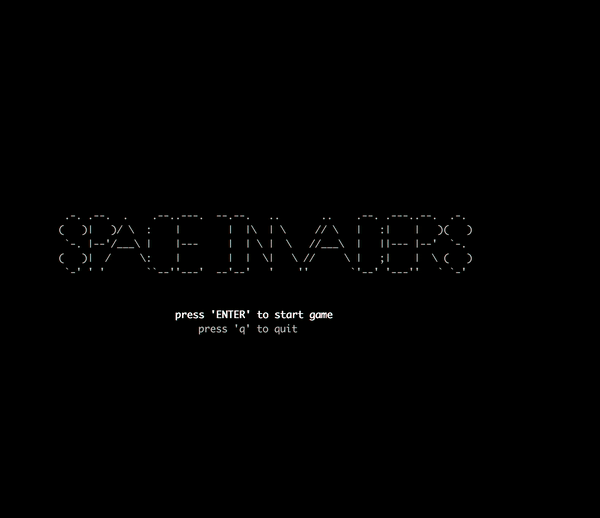

# Ft_retro

This small side shooter was part of a weekend project during one of [42 Silicon Valley's](https://www.42.us.org/) C++ 2-week intensive training course at the end of 2018. Using ncurses as the "graphics engine" the project focused on implementing good OPP design after being introduced to the language 5 days before.

This project was done along with Mi Hwangbo.



## Installation
*Note: This was compiled on MacOS 10.13.3 with a 3.2 GHz Intel Core i5*

This game runs in the terminal so do make sure your terminal is a good size to play.

Then just run:
```bash
git clone https://github.com/tfdiaz/ft_retro
cd ft_retro
make && make clean
./ft_retro
```

## Controls

* Arrow Keys to move
* Space Bar to shoot
* Q to quit

## Technical Notes

It is difficult to die in this game and that is in part because the player has to be at the same location as an astroid to die. There is no collusion area and while the game runs, the purpose was mainly to understand OPP design.
